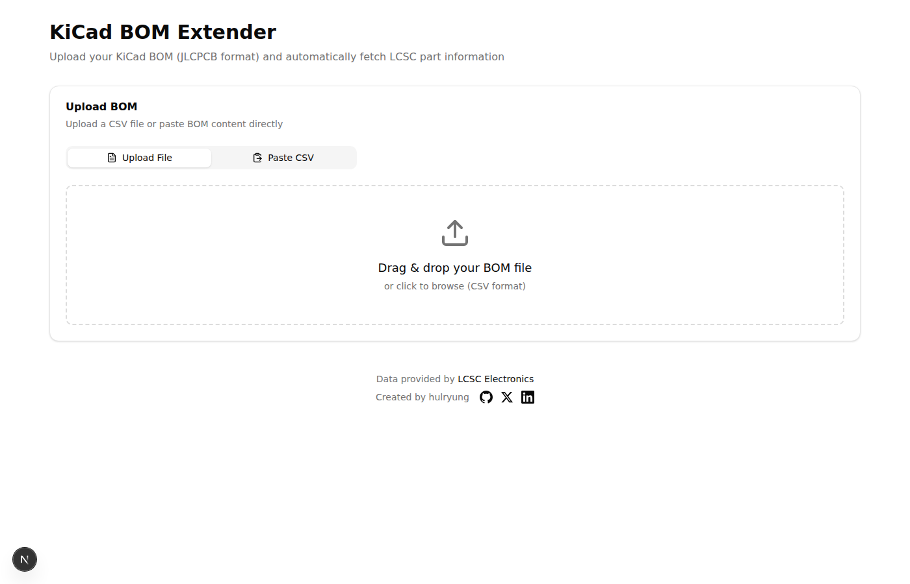
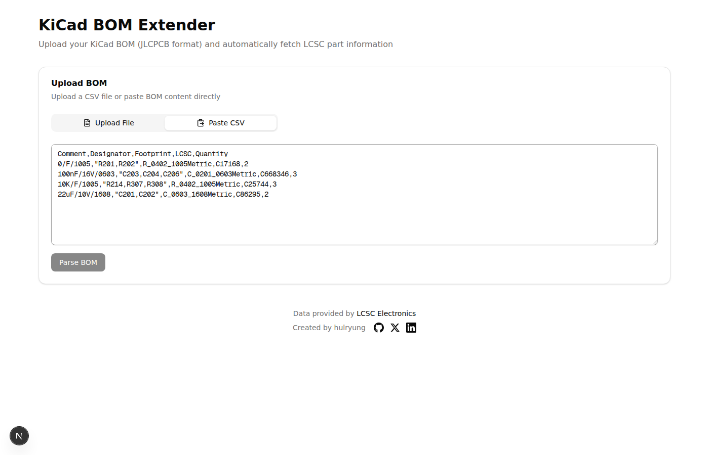
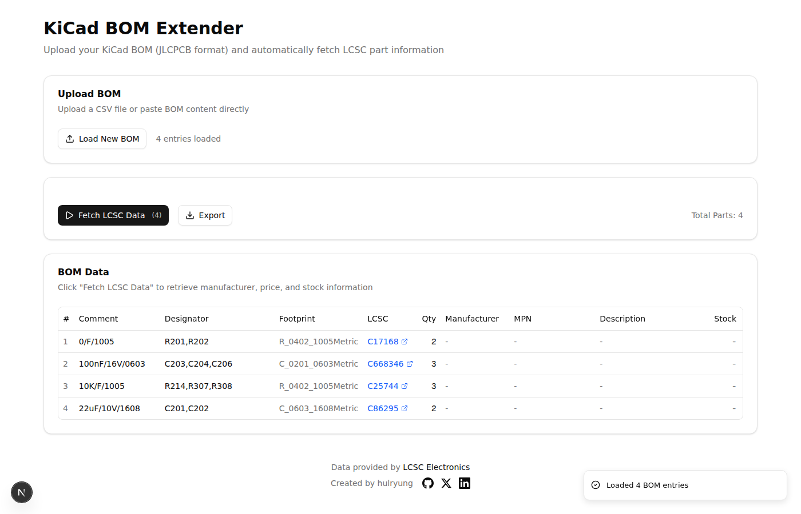
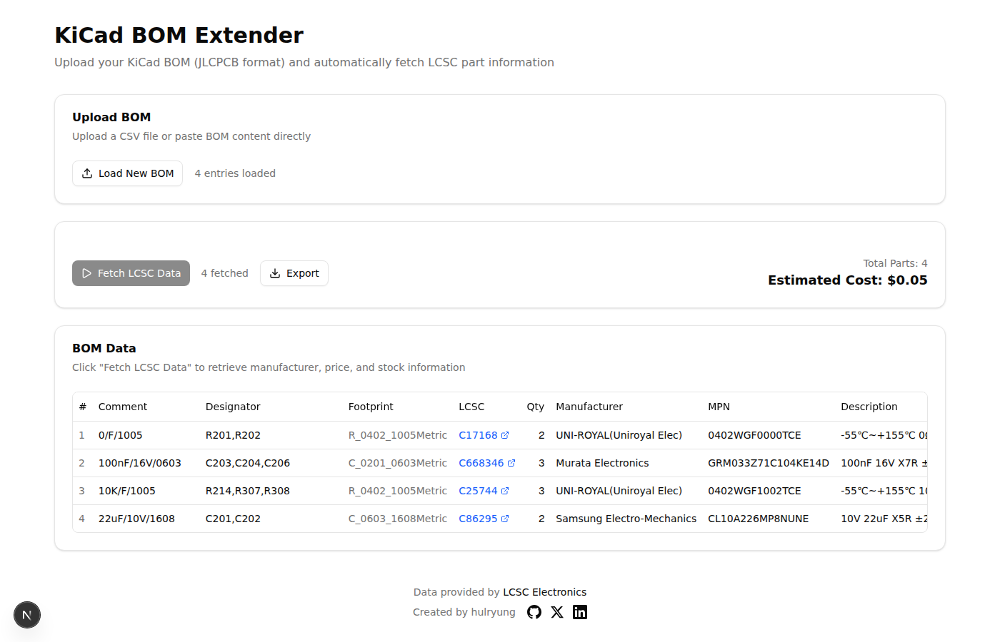

# KiCad BOM Extender

A web application that extends KiCad BOM (Bill of Materials) files with LCSC part information including manufacturer, description, stock, and pricing data.

## Features

- **BOM Upload**: Drag & drop CSV files or paste BOM content directly
- **LCSC Data Fetching**: Automatically fetch part information using LCSC part numbers
  - Manufacturer name
  - Manufacturer Part Number (MPN)
  - Description
  - Package type
  - Stock availability
  - Pricing tiers
- **Data Export**: Download extended BOM as Excel (.xlsx) or CSV
- **Cost Calculation**: Automatic unit and total price calculation based on quantity

## Screenshots

### Upload BOM


### Paste CSV Content


### BOM Table View


### Fetched LCSC Data


## Supported BOM Format

This tool works with KiCad BOM files exported for JLCPCB assembly service:

```csv
Comment,Designator,Footprint,LCSC,Quantity
100nF/16V/0603,"C203,C204,C206",C_0201_0603Metric,C668346,3
10K/F/1005,"R214,R307,R308",R_0402_1005Metric,C25744,3
```

## Tech Stack

- **Framework**: Next.js 15 (App Router)
- **UI**: shadcn/ui + Tailwind CSS
- **State Management**: Zustand + Immer
- **CSV Parsing**: PapaParse
- **Excel Export**: SheetJS (xlsx)

## Getting Started

### Prerequisites

- Node.js 18+
- npm or yarn

### Installation

```bash
# Clone the repository
git clone https://github.com/yourusername/bom-extender.git
cd bom-extender

# Install dependencies
npm install

# Start development server
npm run dev
```

Open [http://localhost:3000](http://localhost:3000) in your browser.

### Production Build

```bash
npm run build
npm start
```

## Usage

1. **Upload BOM**: Drag and drop your KiCad BOM CSV file or paste the content directly
2. **Fetch Data**: Click "Fetch LCSC Data" to retrieve part information
3. **Review**: Check the extended BOM table with manufacturer and pricing data
4. **Export**: Download as Excel or CSV using the Export dropdown

## Project Structure

```
src/
├── app/
│   ├── api/lcsc/route.ts    # LCSC API proxy (Edge Function)
│   ├── layout.tsx
│   └── page.tsx             # Main page
├── components/
│   ├── bom/
│   │   ├── BomUploader.tsx  # File upload & paste
│   │   ├── BomTable.tsx     # BOM data table
│   │   └── BomExporter.tsx  # Export buttons
│   └── lcsc/
│       └── LcscFetcher.tsx  # LCSC fetch controls
├── hooks/
│   ├── useBomStore.ts       # Zustand store
│   └── useLcscFetch.ts      # LCSC fetch hook
└── lib/
    ├── bom/
    │   ├── types.ts         # Type definitions
    │   ├── parser.ts        # CSV parsing
    │   └── exporter.ts      # Excel/CSV export
    └── lcsc/
        ├── api.ts           # LCSC API client
        └── rate-limiter.ts  # Request throttling
```

## API Rate Limiting

The application includes built-in rate limiting to avoid overwhelming the LCSC API:
- Maximum 2 concurrent requests
- 500ms delay between requests

## Deployment

This project can be deployed to Vercel or any platform that supports Next.js:

```bash
# Deploy to Vercel
npx vercel
```

## License

MIT

## Acknowledgments

- Part data provided by [LCSC Electronics](https://www.lcsc.com)
- UI components from [shadcn/ui](https://ui.shadcn.com)
